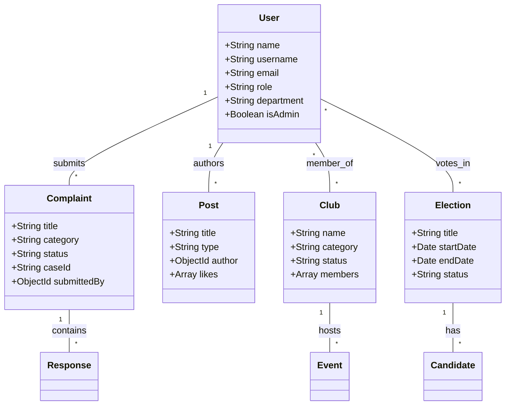
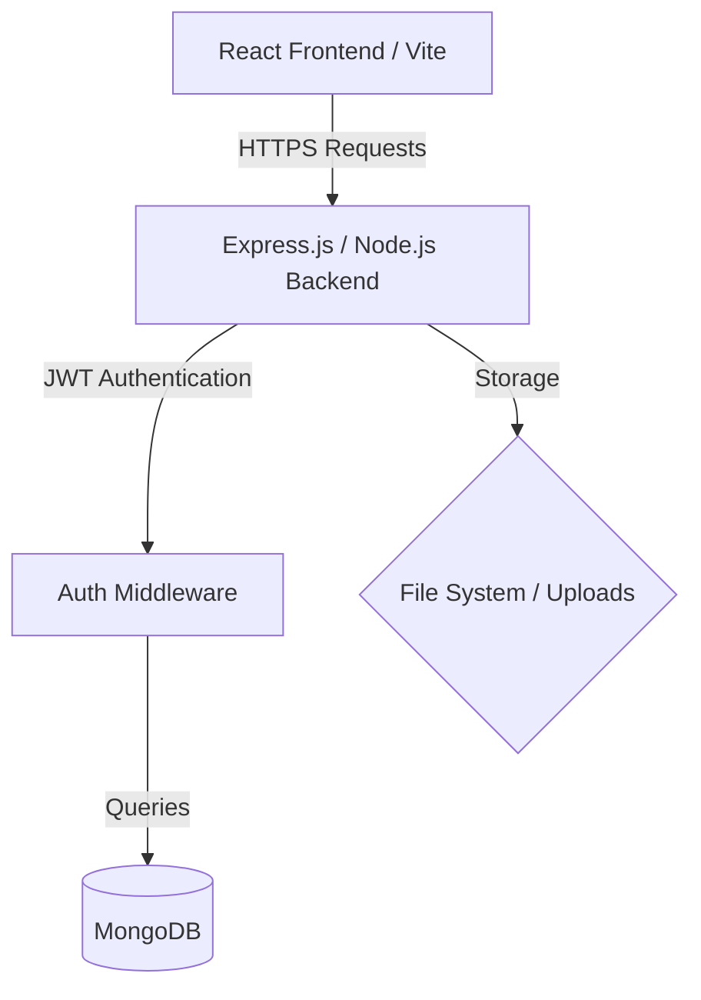

# DBU Student Council Portal 🏛️

A comprehensive management system for the Debre Berhan University (DBU) Student Union. This platform streamlines campus communication, club management, election processes, and the student grievance system.

## 🌟 Overview

The DBU Student Council Portal is a full-stack MERN application designed to empower students and administrators. It provides a centralized hub for all student union activities, ensuring transparency, efficiency, and engagement across the campus.

---

## 📸 Visual Documentation

### 🎭 Use Case Diagram
Describes the interactions between Students and the specific levels of Administration.

```mermaid
useCaseDiagram
    actor "Student" as student
    actor "System Admin" as sysadmin
    actor "President Admin" as presadmin
    actor "Club Admin" as clubadmin
    
    package "Public/Student Features" {
        student --> (View News & Events)
        student --> (Register for Events)
        student --> (Submit & Track Complaints)
        student --> (Join Student Clubs)
        student --> (Vote in Elections)
    }
    
    package "Administrative Workflows" {
        sysadmin --> (Manage User Database)
        sysadmin --> (System Health Monitoring)
        
        presadmin --> (Final Election Oversight)
        presadmin --> (Handle General/Academic Complaints)
        presadmin --> (Publish News & Announcements)
        
        clubadmin --> (Manage Club Approvals)
        clubadmin --> (Monitor Club Budgets)
        clubadmin --> (Handle Student Activity Reports)
    }
```

## 👥 Use Case Differentiation

### 🛠️ System Administrator
*   **Database Management**: Responsible for the technical integrity of the user data and student records.
*   **Access Control**: Managing global system settings and security protocols (CORS, JWT configuration).
*   **Infrastructure**: Monitoring server uptime and resolving technical platform errors.

### 🏛️ President Admin
*   **Executive Governance**: Oversights the final results of student union elections and official university-wide announcements.
*   **Student Grievances**: Primary responder for high-level academic and student affairs complaints.
*   **Crisis Communication**: Responsible for publishing "Pinned" or "Urgent" announcements.

## 📖 Detailed Use Case Descriptions

### 🎓 Student User Stories
| Use Case | Description | Pre-condition | Post-condition |
| :--- | :--- | :--- | :--- |
| **Account Registration** | Student creates a new account to access the union portal. | Valid University ID. | Account created; pending activation. |
| **Grievance Submission** | Student submits a formal complaint regarding campus services. | Logged in. | Unique `CASE-ID` generated for tracking. |
| **Club Enrollment** | Student applies to join an academic or sports club. | Logged in. | Membership request sent to Club Admin. |
| **Secure Voting** | Student casts a vote in a current union election. | Logged in; Not voted yet. | Vote recorded; Student marked as "Voted". |

### 🛠️ System Administrator
| Use Case | Description | Pre-condition | Post-condition |
| :--- | :--- | :--- | :--- |
| **User Management** | Modifying user permissions or deactivating accounts. | Admin Login. | User roles updated in the database. |
| **System Audit** | Checking platform health and database logs. | Admin Login. | Technical issues identified or logs verified. |
| **Security Override** | Resolving lockouts or resetting system-wide secrets. | Admin Login. | System accessibility restored. |

### 🏛️ President Admin
| Use Case | Description | Pre-condition | Post-condition |
| :--- | :--- | :--- | :--- |
| **Election Declaration** | Initializing a new union election cycle. | Admin Login. | Candidates can register; Timeline visible. |
| **Public Announcement** | Publishing high-priority campus news or alerts. | Admin Login. | News appears on Student Home Page. |
| **Grievance Resolution** | Responding to academic or general complaints. | Admin Login. | Complaint status marked as "Resolved". |

### ⚽ Club Admin
| Use Case | Description | Pre-condition | Post-condition |
| :--- | :--- | :--- | :--- |
| **Club Accreditation** | Reviewing and approving the creation of new clubs. | Admin Login. | New club profile becomes active on portal. |
| **Budget Oversight** | Allocating and tracking club-specific finances. | Admin Login. | Club budget updated for the academic year. |
| **Activity Approval** | Vetting and approving proposed club events/activities. | Admin Login. | Event becomes visible to all students. |

---

### 📊 Class (Data Model) Diagram
Illustrates the relationships between the core entities in the MongoDB database.



### 🏗️ System Architecture
The portal follows a standard MERN stack architecture.



---

## 🚀 Key Features

### 📂 Student Life
- **Club Hub**: Browse academic, sports, and cultural clubs. Apply for membership and track club events.
- **Election Center**: Secure and transparent voting system for union leadership roles.
- **News Feed**: Stay updated with the latest campus news, announcements, and upcoming events.

### ⚖️ Governance
- **Complaint Management**: A formal system for submitting academic or facility-related grievances with real-time tracking.
- **Admin Dashboard**: Specialized roles (President, Dean, Sports Lead) for focused management of different university sectors.

### 🛡️ Security
- **Role-Based Access Control (RBAC)**: Fine-grained permissions for students and various administrative staff.
- **Secure Auth**: JWT-based authentication and Bcryp-hashed passwords.

---

## 🛠️ Tech Stack

- **Frontend**: React 18, Vite, Tailwind CSS, Framer Motion, Lucide React
- **Backend**: Node.js, Express.js
- **Database**: MongoDB with Mongoose ODM
- **Real-time Notifications**: React Hot Toast
- **Security**: Helmet, CORS, Rate Limiting, JWT

---

## ⚙️ Installation & Setup

### Prerequisites
- Node.js (v16+)
- MongoDB (Running locally or on Atlas)
- npm or yarn

### 1. Clone & Install
```bash
git clone <repository-url>
cd "dbu student councel portal"

# Setup Backend
cd project/project/project/backend
npm install

# Setup Frontend
cd ../..
npm install
```

### 2. Configuration
Create a `.env` file in the `backend` directory:
```env
PORT=5000
MONGODB_URI=mongodb://localhost:27017/student_union_db
JWT_SECRET=your_jwt_secret
NODE_ENV=development
```

### 3. Run the Application
```bash
# Start Backend (from backend dir)
npm run dev

# Start Frontend (from root project dir)
npm run dev
```

---

## 📁 Project Structure

```text
├── backend/            # Express server & API
│   ├── models/         # Mongoose schemas
│   ├── routes/         # API endpoints
│   ├── middleware/     # Auth & Error handling
│   └── utils/          # Helper scripts
├── src/                # React application
│   ├── components/     # UI Components
│   ├── contexts/       # State management
│   ├── hooks/          # Custom React hooks
│   └── services/       # API integration
└── public/             # Static assets
```

---

## 📜 License
This project is licensed under the MIT License - see the [LICENSE](LICENSE) file for details.

## 📞 Support
For assistance or suggestions, contact the DBU Student Union Development Team.
add admin academic affairs  with username  dbu10101021 and password is Admin123# the see the page dashboard ,can post news only in accademic related, and give vote to the elction ,join in to club  and resove compliant with the student write in accademic affairs cattagory but other catagory compliant only see